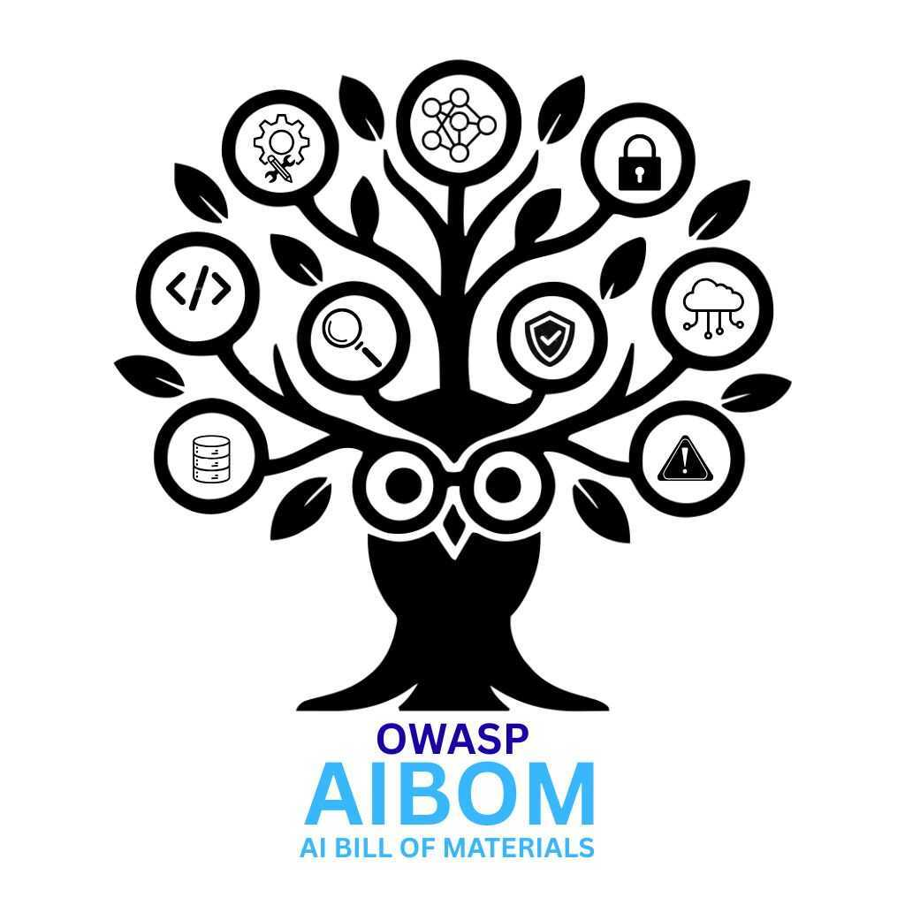

---

layout: col-sidebar
title: OWASP AI Bill of Materials (AIBOM)
tags: ai, security, bill-of-materials, transparency, governance
level: 2
type: documentation
pitch: Bringing transparency and security to AI model supply chains through standardized documentation

---

  

# OWASP AI Bill of Materials (AIBOM) Project

> **Making AI Systems Transparent, Auditable, and Secure**

---

## Project Announcement

We're excited to announce the **formal launch of the OWASP AI Bill of Materials (AIBOM) Project!** 

Just as Software Bill of Materials (SBOMs) and Hardware Bill of Materials (HBOMs) brought clarity to software and hardware supply chains, **AIBOM aims to provide transparency into how AI models are built, trained, and deployed**.

Building on OWASP's long-standing tradition of making security visible, we're now extending this mission to AI systems to address the critical need for AI model transparency across the ecosystem.

---

## Project Mission

The OWASP AIBOM Project establishes a comprehensive framework that:

### **Identifies and Documents**
- **Model lineage** and provenance
- **Training datasets** and data sources
- **Model risks** and vulnerabilities  
- **Dependencies** and third-party components

### **Supports Secure AI Adoption**
- Enables secure deployment across industries and geographies
- Provides risk assessment and mitigation strategies
- Facilitates compliance with emerging AI regulations

### **Bridges Communities**
- Connects practitioners, researchers, regulators, and vendors
- Promotes open collaboration and knowledge sharing
- Establishes industry-wide standards and best practices

---

## Why AIBOM Matters

As organizations increasingly rely on AI to make critical decisions and automate processes, it becomes essential to understand:

- **How models are built** - datasets, methodologies, and training processes
- **Data lineage and quality** - ensuring integrity and reducing bias
- **Risk factors** - identifying potential vulnerabilities and limitations
- **Compliance requirements** - meeting regulatory and governance standards

AIBOM provides this visibility, ensuring AI systems are **auditable**, **traceable**, and **trustworthy**, helping organizations mitigate risks such as bias, data integrity issues, and unintended consequences.

---

## Strategic Collaborations

This initiative ensures alignment and collaboration with key OWASP projects and industry standards:

- **🔄 OWASP CycloneDX** - Defining AIBOM format and attributes
- **🤖 OWASP AI Exchange** - Supporting organizational AIBOM adoption
- **🏛️ Industry Standards Bodies** - Ensuring regulatory compliance
- **🔬 Research Communities** - Advancing AI transparency methodologies

---

## Project Roadmap

### **Phase 1: Foundation & Best Practices**
**AIBOM Operationalizing Guide and Best Practices**

- **Objective:** Create comprehensive guidance for AIBOM operationalization and best practices for secure AI systems
- **Target Audience:** Regulators, CISOs, Chief AI Officers, CTOs, Developers, AI Security Architects, LLMOps Engineers
- **Timeline:** 
  - 📅 Review: November 2025
  - 🚀 Publication: February 2026

### **Phase 2: Standards & Format**
**AIBOM Format Review & Standardization**

- **Objective:** Develop and review AIBOM format ensuring alignment with industry standards and regulatory requirements
- **Focus Areas:** Security, safety, and trust aspects
- **Timeline:** 
  - 📅 Review: November 2025
  - 🚀 Publication: February 2026

### **Phase 3: Tooling & Implementation**
**AIBOM Development Tools**

- **Objective:** Develop tools supporting AIBOM implementation and usage for AI system security and trustworthiness
- **Deliverables:** Open-source tools, validation frameworks, integration guides
- **Timeline:** 
  - 📅 Review: August - December 2025
  - 🚀 Publication: March 2026

### **Phase 4: Sustainability & Growth**
**Funding & Strategic Partnerships**

- **Objective:** Secure sustainable funding through strategic partnerships and industry collaboration
- **Activities:** Company discussions, partnership development, fundraising initiatives
- **Timeline:** 
  - 🤝 Partnership Discussions: November 2025
  - 📈 Fundraising Launch: December 2025

### **Phase 5: Community & Awareness**
**Promotion & Industry Engagement**

- **Objective:** Raise awareness and promote AIBOM adoption across the AI community
- **Activities:** Conference presentations, industry events, community outreach
- **Timeline:** 
  - 🎤 Conference Applications: January 2026

---

## Get Involved

We're actively building our community and welcome contributions from:

### **Who Should Join**
- **🔐 Security Professionals** - CISOs, Security Architects, Security Engineers
- **🤖 AI Practitioners** - Data Scientists, ML Engineers, AI Researchers
- **🏛️ Governance Leaders** - Chief AI Officers, CTOs, Compliance Officers
- **📋 Regulators & Standards Bodies** - Policy makers, industry standard organizations
- **🔧 Developers & Vendors** - Tool developers, platform providers

### **Current Initiatives**
- 🏗️ **Forming the core project team**
- 🌟 **Welcoming community members to contribute**
- 🤝 **Inviting sponsors and partners to accelerate this global initiative**

### **How to Participate**

#### For OWASP Members:
- 💬 **Join us on OWASP Slack** to collaborate directly on this initiative
- 📧 **Subscribe to project updates** for the latest developments
- 🎯 **Attend working group sessions** and contribute to ongoing discussions

#### For Everyone:
- ⭐ **Star this project** to stay updated
- 📝 **Contribute to documentation** and best practices
- 🔧 **Help develop tools** and reference implementations
- 📢 **Spread awareness** in your networks and communities

### **Upcoming Events**
- 🎥 **Virtual Zoom Sessions** - Goals, roadmap, and collaboration opportunities
- 🗓️ **Regular Working Group Meetings** - Technical discussions and progress updates
- 🎤 **Conference Presentations** - Industry events and speaking opportunities

---

## Contact & Resources

- **Project Homepage:** [OWASP AIBOM](https://owasp.org/www-project-aibom/)
- **OWASP Slack:** Join the #project-aibom-community channel [You need to be signed into OWASP Workspace to join the channel]
OWASP Slack Workspace:  [Slack Invite Link](https://owasp.slack.com/join/shared_invite/zt-3f5o62ulw-JBfsuvEjAQECsdk_DRuF8w#/shared-invite/email)
- **Project Membership Form:** Join the OWASP AIBOM community — <a href="https://forms.gle/RLqU7mP5zpFaMvkR9" target="_blank">Fill Out Form</a>
- **GitHub Repository:** Contribute to our open-source efforts

---

## Sponsorship

- **Sponsorship Deck:** Learn how to support and partner with the OWASP AIBOM project — [View Deck](https://drive.google.com/file/d/1W_7dONqH2H4cxMywxQEv3wTjCAvW_Ldk/view?usp=sharing)  
- **Contact for Sponsorship:**  
  **Aruneesh Salhotra** — OWASP AIBOM Project Lead  
  📧 [aruneesh.salhotra@owasp.org](mailto:aruneesh.salhotra@owasp.org)

---

*Let's build the future of AI transparency together! 🚀*

**Tags:** `#OWASP` `#AI` `#AISecurity` `#AIBOM` `#AIGovernance` `#AISupplyChain` `#CyberSecurity` `#BillOfMaterials`
